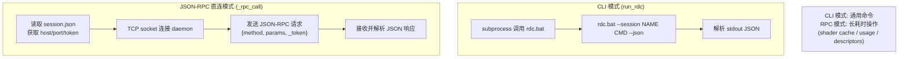
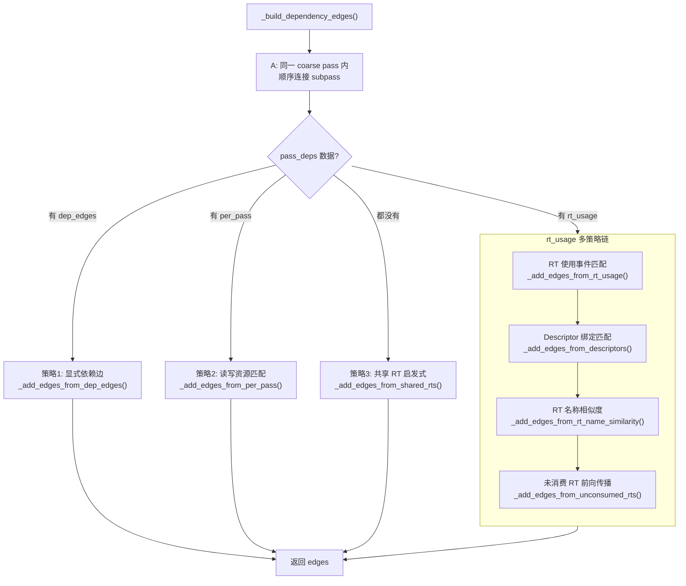
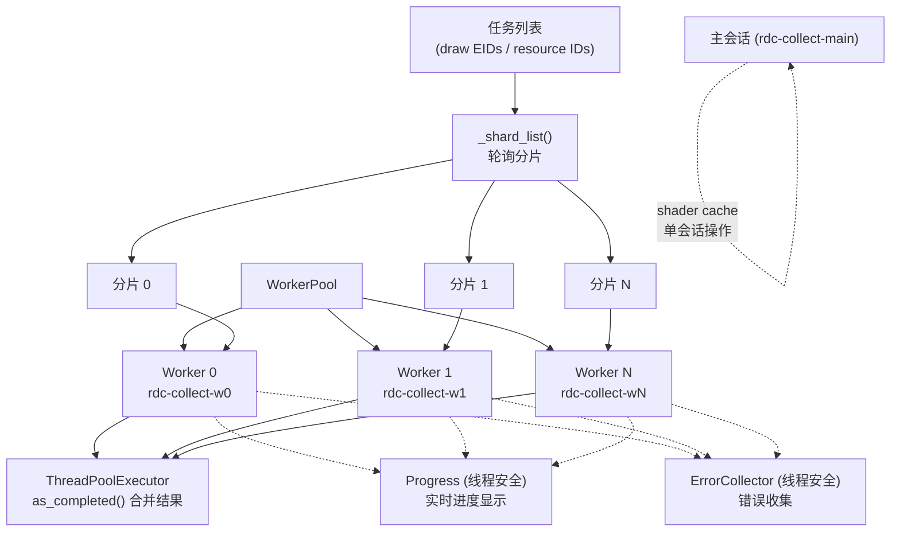
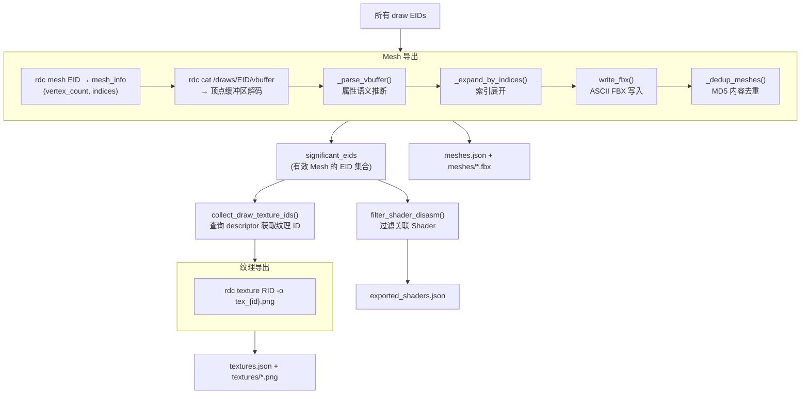

# Scripts/rdc 流程图

## 1. 整体管线流程 (rdc-report.bat)

## 2. collect.py 数据采集流程

```mermaid
flowchart TD
    START([开始]) --> PARSE[解析命令行参数<br/>capture.rdc, -j workers]
    PARSE --> MKDIR["创建输出目录<br/>{stem}-analysis/"]
    MKDIR --> INIT["初始化 ErrorCollector / timings"]

    INIT --> SERIAL_PHASE

    subgraph SERIAL_PHASE ["串行阶段 (主会话)"]
        direction TB
        S1["Step 1: 打开 .rdc 捕获<br/>rdc open capture.rdc"]
        S2["Step 2: 采集基础数据<br/>collect_base()"]
        S3["Step 3: 采集 Pass 详情<br/>collect_pass_details()"]
        S35["Step 3.5: 采集 RT 使用<br/>collect_rt_usage()"]
        S1 --> S2 --> S3 --> S35
    end

    SERIAL_PHASE --> BRANCH{workers > 1 ?}

    BRANCH -- 是 --> PARALLEL_PHASE
    BRANCH -- 否 --> SERIAL_FALLBACK

    subgraph PARALLEL_PHASE ["并行阶段 (多 Worker 会话)"]
        direction TB
        WP["启动 WorkerPool<br/>各 worker 独立打开 .rdc"]
        P4["Step 4: 并行采集 pipeline + bindings<br/>_collect_per_draw_shard() x N"]
        P5["Step 5: Shader 反汇编<br/>collect_shaders_disasm()<br/>(主会话, shader cache 单会话)"]
        P6["Step 6: 并行采集资源详情<br/>_collect_resources_shard() x N"]
        P65{--export-assets ?}
        P65A["Step 6.5a: 并行导出 Mesh FBX<br/>_collect_meshes_shard() x N"]
        P65B["Step 6.5b: 采集纹理 ID<br/>collect_draw_texture_ids()"]
        P65C["Step 6.5c: 并行导出纹理 PNG<br/>_collect_textures_shard() x N"]
        WP_CLOSE["关闭 Worker 会话"]

        WP --> P4 --> P5 --> P6 --> P65
        P65 -- 是 --> P65A --> P65B --> P65C --> WP_CLOSE
        P65 -- 否 --> WP_CLOSE
    end

    subgraph SERIAL_FALLBACK ["串行阶段 (单会话 fallback)"]
        direction TB
        F4["Step 4: 逐个采集 pipeline + bindings<br/>collect_per_draw()"]
        F5["Step 5: Shader 反汇编<br/>collect_shaders_disasm()"]
        F6["Step 6: 逐个采集资源详情<br/>collect_resource_details()"]
        F65{--export-assets ?}
        F65A["Step 6.5a: 导出 Mesh FBX<br/>collect_meshes()"]
        F65B["Step 6.5b: 采集纹理 ID<br/>collect_draw_texture_ids()"]
        F65C["Step 6.5c: 导出纹理 PNG<br/>collect_textures()"]

        F4 --> F5 --> F6 --> F65
        F65 -- 是 --> F65A --> F65B --> F65C
        F65 -- 否 --> POST_MERGE_ANCHOR[ ]
    end

    PARALLEL_PHASE --> POST_MERGE
    SERIAL_FALLBACK --> POST_MERGE

    subgraph POST_MERGE ["后处理阶段"]
        direction TB
        S7["Step 7: 计算分析<br/>compute_analysis()"]
        S75["Step 7.5: TSV 导出<br/>export_tsv()<br/>(含 pipeline_stages 分类)"]
        S8["Step 8: 生成 Render Graph HTML<br/>generate_render_graph_html()"]
        S9["Step 9: 关闭主会话<br/>rdc close"]
        S7 --> S75 --> S8 --> S9
    end

    POST_MERGE --> META["写入 _collection.json<br/>(版本/耗时/错误数)"]
    META --> DONE([完成])
```

## 3. analyze.py 报告生成流程

```mermaid
flowchart TD
    START([开始]) --> LOAD["加载 JSON 数据<br/>load_analysis()"]

    LOAD --> ANALYSIS

    subgraph ANALYSIS ["分析模块 (并行独立)"]
        direction LR
        A1["analyze_frame_overview()<br/>API/分辨率/DrawCall/三角形"]
        A2["analyze_pipeline()<br/>Pass 分类/Gantt 数据"]
        A2b["analyze_pipeline_stages()<br/>阶段分类/GPU时间/Bloom检测"]
        A3["analyze_hotspots()<br/>Top DrawCall/重复 Mesh"]
        A4["analyze_bandwidth()<br/>带宽估算/Bloom 统计"]
        A5["analyze_shaders()<br/>SPIR-V 复杂度分析"]
        A6["analyze_memory()<br/>纹理内存/格式分布"]
    end

    ANALYSIS --> SUGGEST["generate_suggestions()<br/>综合各模块生成优化建议"]
    SUGGEST --> RENDER["render_html()<br/>组装 HTML 报告"]

    subgraph RENDER_SECTIONS ["HTML 报告章节"]
        direction TB
        H1["01 Frame Overview — 信息卡片"]
        H2["02 Rendering Pipeline — Gantt图 + 表格"]
        H2b["03 Pipeline Stage Analysis — 阶段分布 + Bloom链 + 分类表"]
        H3["04 Hotspots — 条形图 + 重复 Mesh 表"]
        H4["05 Bandwidth — 带宽条形图"]
        H5["06 Shader Complexity — Shader 表格"]
        H6["07 Memory — 资源大小 + 格式分布"]
        H7["08 Suggestions — 优化建议卡片"]
        H1 --> H2 --> H2b --> H3 --> H4 --> H5 --> H6 --> H7
    end

    RENDER --> RENDER_SECTIONS
    RENDER_SECTIONS --> WRITE["写入 performance_report.html"]
    WRITE --> DONE([完成])
```

## 4. RPC 通信流程

## 5. Render Graph 依赖边构建策略

## 6. 并行 Worker 架构

## 7. 资源导出流程 (--export-assets)

